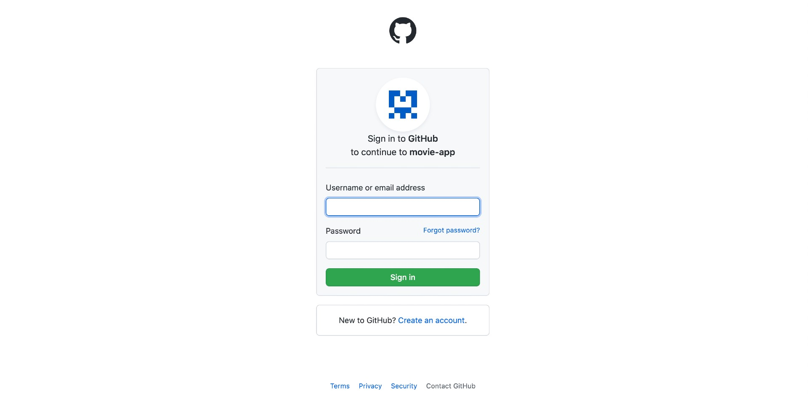
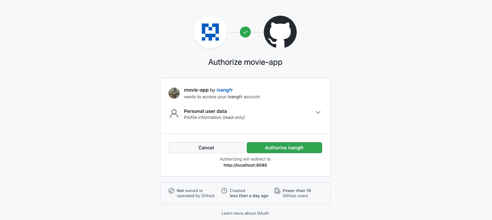

# springboot-react-social-login

The goal of this project is to implement an application called `movie-app` to manage movies. For it, we will implement a back-end application called `movie-api` using [`Spring Boot`](https://docs.spring.io/spring-boot/docs/current/reference/htmlsingle/) and a font-end application called `movie-ui` using [ReactJS](https://reactjs.org/). Besides, we will use [`OAuth2`](https://en.wikipedia.org/wiki/OAuth#OAuth_2.0) (Social Login) to secure both applications.

## Applications

- ### movie-api

  `Spring Boot` Web Java backend application that exposes a Rest API to create, retrieve and delete movies. If a user has `ADMIN` role he/she can also retrieve information of other users or delete them. The application secured endpoints can just be accessed if a valid JWT access token is provided.
  
  In order to get the JWT access token, the user can login using the credentials (`username` and `password`) created when he/she signed up directly to the application.
  
  `movie-api` stores its data in [`MySQL`](https://www.mysql.com/) database.

  `movie-api` has the following endpoints

  | Endpoint                                                      | Secured | Roles           |
  | ------------------------------------------------------------- | ------- | --------------- |
  | `POST /auth/authenticate -d {"username","password"}`          | No      |                 |
  | `POST /auth/signup -d {"username","password","name","email"}` | No      |                 |
  | `GET /public/numberOfUsers`                                   | No      |                 |
  | `GET /public/numberOfMovies`                                  | No      |                 |
  | `GET /api/users/me`                                           | Yes     | `ADMIN`, `USER` |
  | `GET /api/users`                                              | Yes     | `ADMIN`         |
  | `GET /api/users/{username}`                                   | Yes     | `ADMIN`         |
  | `DELETE /api/users/{username}`                                | Yes     | `ADMIN`         |
  | `GET /api/movies [?text]`                                     | Yes     | `ADMIN`, `USER` |
  | `POST /api/movies -d {"imdb","description"}`                  | Yes     | `ADMIN`         |
  | `DELETE /api/movies/{imdb}`                                   | Yes     | `ADMIN`         |

- ### movie-ui

  `ReactJS` frontend application where a user with role `USER` can retrieve the information about movies. On the other hand, a user with role `ADMIN` has access to all secured endpoints, including endpoints to create and delete movies.
  
  In order to access the application, a `user` or `admin` can login using his/her `Github` account or using the credentials (`username` and `password`) created when he/she signed up directly to the application. All the requests coming from `movie-ui` to secured endpoints in `movie-api` have the JWT access token. This token is generated when the `user` or `admin` logins.
  
  `movie-ui` uses [`Semantic UI React`](https://react.semantic-ui.com/) as CSS-styled framework.

## Creating OAuth2 apps for Social Login

- **Github**

  In this [link](https://github.com/ivangfr/springboot-react-social-login/blob/master/create-github-oauth2-app.md), it's explained how to create a Github App

> **Note**: Other providers like `Facebook`, `Twitter`, etc will be added later

## How Social Login Works?

To explain how it works, we will use `Github` as OAuth2 provider example. By the way, this flow is similar to other providers. All the OAuth2 provider configuration is done in the [application.yml](https://github.com/ivangfr/springboot-react-social-login/blob/master/movie-api/src/main/resources/application.yml). The `oauth2Login` configuration is done in [`WebSecurityConfig`](https://github.com/ivangfr/springboot-react-social-login/blob/master/movie-api/src/main/java/com/ivanfranchin/movieapi/security/WebSecurityConfig.java)

1. The Social Login with `Github` starts with `movie-app` client redirecting the user to the following URL
   ```
   http://localhost:8080/oauth2/authorization/github
   ```

1. The OAuth2 provider will receive the request similar to
   ```
   https://github.com/login/oauth/authorize?response_type=code&client_id=<CLIENT_ID>&scope=read:user&state=<STATE>&redirect_uri=http://localhost:8080/login/oauth2/code/github
   ```

1. The user is redirected to the OAuth2 provider login form
   ```
   https://github.com/login?client_id=<CLIENT_ID>&return_to=/login/oauth/authorize?client_id=<CLIENT_ID>&redirect_uri=http://localhost:8080/login/oauth2/code/github&response_type=code&scope=read:use&state=<STATE>
   ```

1. User provides his/her credentials

   

1. User allows or denies the permissions to `movie-app`

   

   - If **user denies permissions**, the OAuth2 provider will redirect the user to the callback URL registered when creating the `movie-app` with an error.

     The component that handles it is the `Spring Boot` default [`SimpleUrlAuthenticationFailureHandler`](https://github.com/spring-projects/spring-security/blob/master/web/src/main/java/org/springframework/security/web/authentication/SimpleUrlAuthenticationFailureHandler.java). It can be customized if needed.

   - If **user allows permissions**, the OAuth2 provider will redirect the user to the callback URL registered when creating the `movie-app` with the `authorization_code`
   
     The redirect URL will be similar to
     ```
     http://localhost:8080/login/oauth2/code/github?code=<CODE>&state=<STATE>
     ```

     Once received the redirect, Spring Security will exchange the `authorization_code` for an `access_token` and call [`CustomOAuth2UserService`](https://github.com/ivangfr/springboot-react-social-login/blob/master/movie-api/src/main/java/com/ivanfranchin/movieapi/security/oauth2/CustomOAuth2UserService.java) that will check (by `username`) whether the user is present or not in the `movie-app` database. If it is not present, a new entry for the user is created; otherwise, a few user information (like `imageUrl` and `email`) is updated.

     In the end, the component [`CustomAuthenticationSuccessHandler`](https://github.com/ivangfr/springboot-react-social-login/blob/master/movie-api/src/main/java/com/ivanfranchin/movieapi/security/oauth2/CustomAuthenticationSuccessHandler.java), extends [`SimpleUrlAuthenticationSuccessHandler`](https://github.com/spring-projects/spring-security/blob/master/web/src/main/java/org/springframework/security/web/authentication/SimpleUrlAuthenticationSuccessHandler.java), is invoked. It's responsible for creating a JWT access token and sending it to the user in the `redirect_uri`. We are using as `redirect_uri` a url present in `movie-ui`, `http://localhost:3000/oauth2/redirect`. The JWT token informed in the `redirect_uri` as a query string, like it's shown below
     ```
     http://localhost:3000/oauth2/redirect?token=eyJ0eXAiOiJKV1QiLCJhbGc...xaY0KWdqG2JDDk-iIrgIPDZvcA7Q
     ```

## Prerequisites

- [`npm`](https://docs.npmjs.com/downloading-and-installing-node-js-and-npm)
- [`Java 17+`](https://www.oracle.com/java/technologies/downloads/#java17)
- [`Docker`](https://www.docker.com/)
- [`Docker-Compose`](https://docs.docker.com/compose/install/)
- [`jq`](https://stedolan.github.io/jq)

## Start Environment

- Open a terminal and inside `springboot-react-social-login` root folder run
  ```
  docker-compose up -d
  ```

- Wait for `mysql` Docker container to be up and running. To check it, run
  ```
  docker-compose ps
  ```

## Running movie-app using Maven & Npm

- **movie-api**

  - Open a terminal and navigate to `springboot-react-social-login/movie-api` folder

  - Export the following environment variables for the `Client ID` and `Client Secret` of the Social Apps (see how to get them in [Creating OAuth2 apps for Social Login](#creating-oauth2-apps-for-social-login))
    ```
    export GITHUB_CLIENT_ID=...
    export GITHUB_CLIENT_SECRET=...
    ```

  - Run the following `Maven` command to start the application
    ```
    ./mvnw clean spring-boot:run
    ```

- **movie-ui**

  - Open another terminal and navigate to `springboot-react-social-login/movie-ui` folder

  - Run the command below if you are running the application for the first time
    ```
    npm install
    ```

  - Run the `npm` command below to start the application
    ```
    npm start
    ```

## Applications URLs

| Application  | URL                                   | Credentials                                         |
| ------------ | ------------------------------------- | --------------------------------------------------- |
| movie-api    | http://localhost:8080/swagger-ui.html |                                                     |
| movie-ui     | http://localhost:3000                 | `admin/admin`, `user/user` or signing up a new user |

## Demo

- The gif below shows a `user` loging in using the `Github`

  

- The gif below shows an `admin` loging in using his application account

  

## Testing movie-api Endpoints

- **Manual Test**

  - Access `movie-ui` at http://localhost:3000

  - Click `Login` and then, connect with `Github`
  
  - Provide your `Github` credentials

- **Automatic Endpoints Test**

  - Open a terminal and make sure you are in `springboot-react-social-login` root folder

  - Run the following script
    ```
    ./movie-api/test-endpoints.sh
    ```
    It should return something like the output below, where it shows the http code for different requests
    ```
    POST auth/authenticate
    ======================
    admin access token
    ------------------
    eyJ0eXAiOiJKV1QiLCJhbGciOiJIUzUxMiJ9.eyJleHAiOjE1ODY2MjM1MjksImlhdCI6MTU4Nj..._ha2pM4LSSG3_d4exgA
    
    user access token
    -----------------
    eyJ0eXAiOiJKV1QiLCJhbGciOiJIUzUxMiJ9.eyJleHAiOjE1ODY2MjM1MjksImlhdCIyOSwian...Y3z9uwhuW_nwaGX3cc5A
    
    POST auth/signup
    ================
    user2 access token
    ------------------
    eyJ0eXAiOiJKV1QiLCJhbGciOiJIUzUxMiJ9.eyJleHAiOjE1ODY2MjM1MjksImanRpIjoiYTMw...KvhQbsMGAlFov1Q480qg

    Authorization
    =============
                    Endpoints | without token |  user token |  admin token |
    ------------------------- + ------------- + ----------- + ------------ |
     GET public/numberOfUsers |           200 |         200 |          200 |
    GET public/numberOfMovies |           200 |         200 |          200 |
    ......................... + ............. + ........... + ............ |
            GET /api/users/me |           401 |         200 |          200 |
               GET /api/users |           401 |         403 |          200 |
         GET /api/users/user2 |           401 |         403 |          200 |
      DELETE /api/users/user2 |           401 |         403 |          200 |
    ......................... + ............. + ........... + ............ |
              GET /api/movies |           401 |         200 |          200 |
             POST /api/movies |           401 |         403 |          201 |
       DELETE /api/movies/abc |           401 |         403 |          200 |
    ------------------------------------------------------------------------
     [200] Success -  [201] Created -  [401] Unauthorized -  [403] Forbidden
    ```

## Util Commands

- **MySQL**
  ```
  docker exec -it -e MYSQL_PWD=secret mysql mysql -uroot --database moviedb
  show tables;
  ```

## Shutdown

- To stop `movie-api` and `movie-ui`, go to the terminals where they are running and press `Ctrl+C`

- To stop and remove docker-compose containers, network and volumes, go to a terminal and, inside `springboot-react-social-login` root folder, run the command below
  ```
  docker-compose down -v
  ```

## How to upgrade movie-ui dependencies to latest version

- In a terminal, make sure you are in `springboot-react-social-login/movie-ui` folder

- Run the following commands
  ```
  npm upgrade
  npm i -g npm-check-updates
  ncu -u
  npm install
  ```

## References

- https://www.callicoder.com/spring-boot-security-oauth2-social-login-part-1/