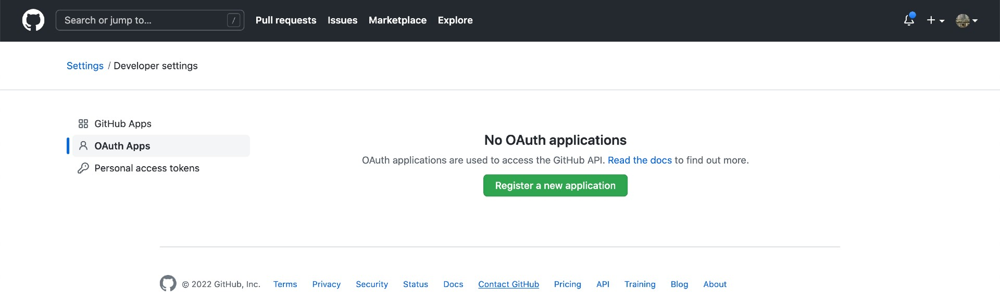
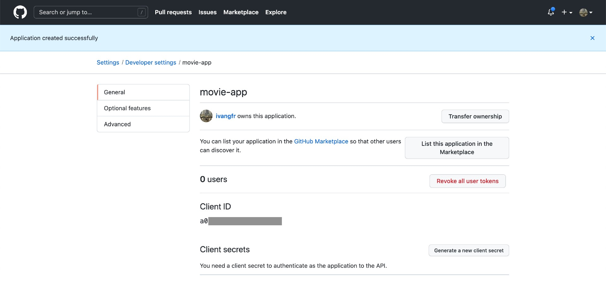

# springboot-react-social-login
## > `Create Github OAuth2 App`

1. Login to your Github account

1. At the top-right corner of the screen, there's a dropdown menu. Click `Settings`

1. In the next page, there's a menu on the left. Click `Developer settings`

1. In `Settings / Developer settings` page, click `OAuth Apps`

1. Add a new app by clicking `Register a new application` button or, if you already have apps created, click `New OAuth App` button present on the right of the screen

   

1. On `Register a new OAuth application` form, set the following mandatory fields

   | Fields                     | Values                                         |
   | -------------------------- | ---------------------------------------------- |
   | Application name           | movie-app                                      |
   | Homepage URL               | http://localhost:8080                          |
   | Authorization callback URL | http://localhost:8080/login/oauth2/code/github |

1. Click `Register application` button

1. In the following page, it's shown the application `Client ID`

   

1. Click `Generate a new client secret` button. Copy the new `Client Secret` now as it won't be shown again.
