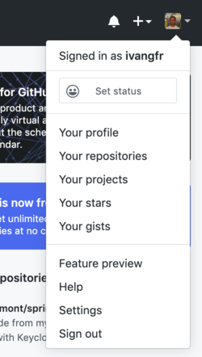
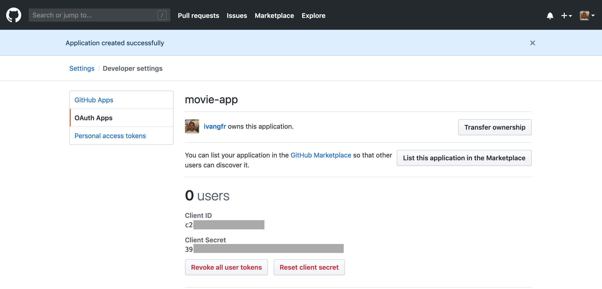

# springboot-react-social-login
## > `Create Github OAuth2 App`

1. Login to your Github account

1. On the top-right corner of the screen, there's a dropdown menu how it's showing in the picture below

   

1. Click on `Settings`

1. In the new page, there's a menu on the left. click on `Developer settings`

1. In `Settings / Developer settings` page, click on `OAuth Apps` and add a new app by clicking on `Register a new application` button or, if you already have apps created, click on `New OAuth App` button present on the right of the screen

   

1. On `Register a new OAuth application` form, set the following mandatory fields

   | Fields                     | Values                                         |
   | -------------------------- | ---------------------------------------------- |
   | Application name           | movie-app                                      |
   | Homepage URL               | http://localhost:8080                          |
   | Authorization callback URL | http://localhost:8080/login/oauth2/code/github |

1. Click on `Register application` button

1. Done! The `move-app` is registered. In the following page, it's shown the `Client ID` and `Client Secret` of the application.

   